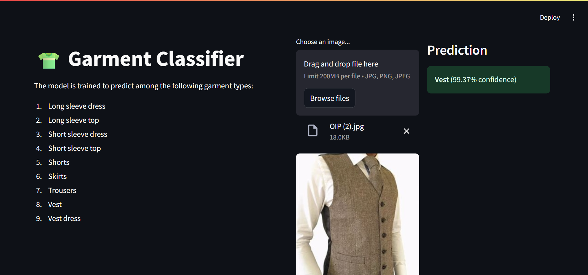

# Garment Classifier App
The Garment Classifier App is a CNN Model that classifies 9 types of garments: 
- Long sleeve dress
- Long sleeve top
- Short sleeve dress
- Short sleeve top
- Shorts
- Skirt
- Trouser
- Vest
- Vest dress

# Model Architecture
- The initial model was a Custom CNN (garmentclassifier (10).ipynb) with the following architecture:
  - 3 Convolutional Layers (32, 64, 128 filters) with ReLU activation
  - BatchNormalization and MaxPooling after each conv layer
  - Flatten + Dense Layer (128 units) + Dropout
  - Final Dense Layer with Softmax activation

  This model achieved ~90% validation accuracy.

- Due to the limitations of the custom CNN, the model was enhanced using VGG16 pretrained on ImageNet.
   - **Modifications:**
      - Base VGG16 layers loaded with include_top=False
      - Only upper convolutional blocks were unfrozen and fine-tuned
      - Added custom classifier:
         - Flatten()
         - Dense(64, activation='relu', kernel_regularizer=regularizers.l2(0.001)
         - Dropout(0.3)
         - Dense(9, activation='softmax')
  - This model achieved:
      - Training Accuracy: ~96%
      - Validation Accuracy: ~95%

# Dataset
The dataset contains 23266 images of various garments and a metadata.csv file containing the labels of these images. 
Dataset Link: https://www.kaggle.com/datasets/lygitdata/garmentiq-classification-set-nordstrom-and-myntra

# Tech Stack
- **Programming Language:** Python  
- **Deep Learning Framework:** TensorFlow / Keras  
- **Pre-trained Model:** VGG16 (fine-tuned convolutional layers)  
- **Libraries:**  
  - NumPy
  - Pandas
  - Matplotlib
  - Scikit Learn
  - OS
  - Shutil
  - Pillow (PIL)  
  - Streamlit  

# Interface Preview

